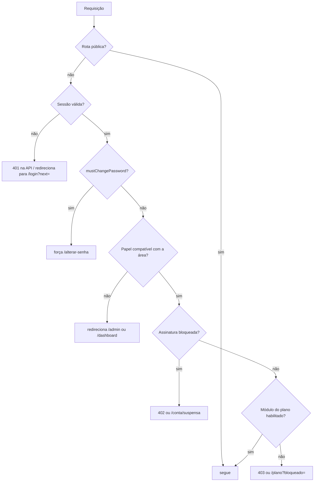
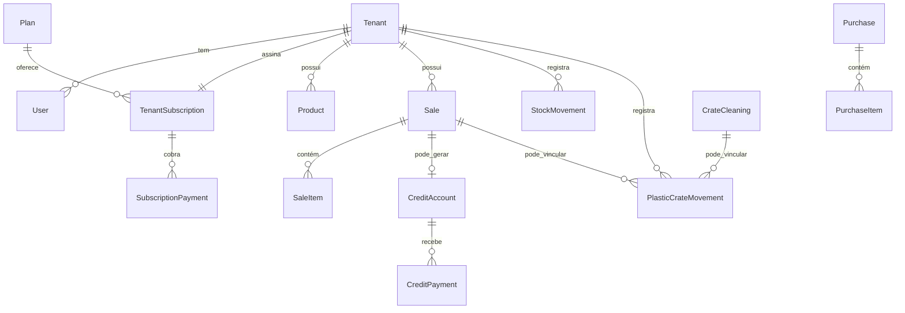

# CeasaPro — Documento do Projeto

Descrição detalhada e autocontida do sistema: o que ele é, como está construído, quais regras de negócio implementa e como operá-lo.

> Este documento consolida em um único lugar o conteúdo distribuído em [`docs/01-visao-geral.md`](01-visao-geral.md) a [`docs/08-desenvolvimento.md`](08-desenvolvimento.md). Para o guia rápido de instalação, veja o [README da raiz](../README.md).

---

## Sumário

1. [Visão geral do produto](#1-visão-geral-do-produto)
2. [Stack técnica](#2-stack-técnica)
3. [Arquitetura](#3-arquitetura)
4. [Multi-tenancy: isolamento por empresa](#4-multi-tenancy-isolamento-por-empresa)
5. [Autenticação, sessão e autorização](#5-autenticação-sessão-e-autorização)
6. [Planos e gating de módulos](#6-planos-e-gating-de-módulos)
7. [Assinatura e cobrança (Mercado Pago)](#7-assinatura-e-cobrança-mercado-pago)
8. [Modelo de dados](#8-modelo-de-dados)
9. [Módulos funcionais e regras de negócio](#9-módulos-funcionais-e-regras-de-negócio)
10. [Mapa de rotas](#10-mapa-de-rotas)
11. [API HTTP](#11-api-http)
12. [Relatórios e exportação](#12-relatórios-e-exportação)
13. [PWA e experiência mobile](#13-pwa-e-experiência-mobile)
14. [Segurança](#14-segurança)
15. [Estrutura de pastas](#15-estrutura-de-pastas)
16. [Testes](#16-testes)
17. [Configuração e variáveis de ambiente](#17-configuração-e-variáveis-de-ambiente)
18. [Execução local](#18-execução-local)
19. [Deploy e operação](#19-deploy-e-operação)
20. [Estado atual do repositório](#20-estado-atual-do-repositório)

---

## 1. Visão geral do produto

O **CeasaPro** é um SaaS de gestão para comercializadores de hortifruti do CEASA. O usuário-alvo é o dono do box — que trabalha em pé, no celular, no meio da operação — e não um contador ou operador de ERP. Isso define a principal restrição de design: **telas simples, mobile-first, poucos cliques, vocabulário do CEASA** (fiado, caixa plástica, higienização, sacaria) em vez de jargão contábil.

Em uma frase: o comerciante cadastra produtos e fornecedores, registra compras (que dão entrada no estoque) e vendas na frente de caixa (que dão baixa e podem virar fiado), controla caixas plásticas, higienização e venda de embalagens, lança despesas e acompanha dashboard e relatórios — tudo isolado por empresa. Em paralelo, um **super-admin** gerencia as empresas assinantes, os planos e a cobrança mensal.

### Os dois públicos

| Papel | Quem é | O que acessa |
|---|---|---|
| `OWNER` | Dono da empresa (tenant) | Toda a operação da própria empresa: `/dashboard`, produtos, vendas, fiado, relatórios, configurações, assinatura |
| `SUPER_ADMIN` | Operador da plataforma CeasaPro | Painel `/admin`: empresas clientes, planos, pagamentos, auditoria global, MRR |

Um `SUPER_ADMIN` tem `tenantId = null` e é o único usuário sem empresa vinculada. Não existe papel intermediário — o modelo assume uma empresa pequena com um dono.

### Conceitos centrais

- **Tenant** — uma empresa assinante. Toda informação operacional pertence a exatamente um tenant.
- **Estoque derivado** — o saldo de estoque nunca é uma coluna que se sobrescreve; é a soma de um livro-razão append-only (`stock_movements`). O mesmo vale para caixas plásticas (`plastic_crate_movements`). Isso torna qualquer número auditável até a origem.
- **Fiado** — venda a prazo com pagamentos parciais, saldo devedor e vencimento; central para o negócio do CEASA.
- **Caixa plástica retornável** — ativo que circula (sai com o cliente, volta suja, vai para higienização, volta limpa, quebra). Não confundir com **embalagem vendida** (papelão, sacaria), que é receita avulsa.
- **Assinatura** — cada tenant tem uma assinatura mensal pré-paga: com teste grátis de 7 dias no cadastro público, tolerância pós-vencimento e bloqueio automático.

---

## 2. Stack técnica

Um único aplicativo full-stack, sem backend separado.

| Camada | Tecnologia |
|---|---|
| Framework | **Next.js 16.2** (App Router) + **React 19.2** + **TypeScript 5** (strict) |
| Banco | **PostgreSQL** via **Prisma 6** |
| UI | **Tailwind CSS 4** + componentes próprios no estilo shadcn/ui (Radix para dialog, tabs, slot) |
| Formulários | react-hook-form + `@hookform/resolvers` + **Zod 4** |
| Estado cliente | TanStack React Query + Zustand + sonner (toasts) |
| Autenticação | **jose** (JWT HS256) + **@node-rs/argon2** (Argon2id) |
| Pagamentos | **Mercado Pago** (SDK server + Card Brick no cliente) |
| E-mail | **SMTP do Gmail** via **nodemailer** |
| Relatórios | **exceljs** (.xlsx) e **pdfmake** (.pdf) |
| Logs | **pino** com redaction |
| Testes | **Vitest** (unit + integração) e **Playwright** (E2E) |
| Datas / números | date-fns, react-number-format, `Prisma.Decimal` |

> ⚠️ Esta versão do Next.js traz mudanças em relação a versões anteriores — notadamente o arquivo `src/proxy.ts` no lugar de `src/middleware.ts`. Consulte `node_modules/next/dist/docs/` antes de escrever código que dependa de convenções do framework.

---

## 3. Arquitetura

### Camadas

```
Cliente (React) 
   ↓
proxy.ts (edge)  →  valida JWT, papel, assinatura e módulo do plano
   ↓
Server Action  |  Route Handler        ← camada fina: só valida (Zod) e delega
   ↓ withTenantAction / withTenantRoute
Service (src/lib/services/)            ← toda a regra de negócio
   ↓ FinancialCalc                      ← todas as fórmulas financeiras
getTenantPrisma(tenantId)              ← Prisma com tenantId injetado
   ↓
PostgreSQL  +  audit_logs  +  ledgers append-only
```

Regras que o código segue de forma consistente:

- **Actions e handlers são finos.** Eles não contêm lógica de negócio — apenas autenticam, validam com Zod e chamam um serviço.
- **Toda fórmula financeira vive em `FinancialCalc`** (`src/lib/services/financial-calc.service.ts`). Nenhum componente ou action calcula lucro, frete rateado ou saldo por conta própria.
- **Nunca `number` para dinheiro.** Aritmética via `src/lib/money.ts` sobre `Prisma.Decimal`.
- **Toda operação financeira grava auditoria** (`src/lib/audit.ts`), com o estado antes e depois.

### API híbrida: quando Server Action, quando Route Handler

A escolha não é arbitrária:

| Tipo de operação | Mecanismo | Exemplos |
|---|---|---|
| CRUD simples de cadastro | **Server Action** | produtos, fornecedores, despesas, categorias, tipos de embalagem, configurações, higienização, movimento de caixas |
| Fluxo transacional multi-tabela, ou consumido por cliente rico | **Route Handler** (`/api/*`) | venda no PDV, compra, fiado (criação e pagamento), ajuste de estoque, exportação de relatório, checkout de assinatura |
| Integrações externas | **Route Handler** | webhook do Mercado Pago, cron de billing |

### Wrappers de guarda

Quatro funções concentram toda a autorização de servidor:

- `withTenantAction` / `withTenantRoute` — exigem `OWNER` com `tenantId`, verificam a assinatura, opcionalmente exigem um módulo do plano, aplicam rate limit e validam a entrada com Zod.
- `withAdminAction` / `withAdminRoute` — exigem `SUPER_ADMIN`.

Erros são tipados em `src/lib/http/app-error.ts` e mapeados para status HTTP: 401 (sem sessão), 402 (assinatura bloqueada), 403 (sem módulo/papel), 409 (conflito), 422 (regra de negócio violada).

---

## 4. Multi-tenancy: isolamento por empresa

Este é o ponto mais crítico do sistema — um vazamento entre empresas seria fatal para o produto. A defesa não depende do programador lembrar de filtrar.

`getTenantPrisma(tenantId)` (`src/lib/db/tenant-prisma.ts`) devolve um Prisma Client estendido via **Prisma Client Extensions** (`$extends`, hook `$allOperations`), que para todo model marcado como tenant-scoped:

1. **Injeta `where.tenantId`** em leituras e writes com `where` — sobrescrevendo qualquer `tenantId` que tenha vindo de fora, o que neutraliza tentativas de forjar o filtro.
2. **Injeta `where.deletedAt = null`** nos models com soft delete (exceto em `upsert`, que precisa do unique puro).
3. **Injeta `data.tenantId`** em `create`, `createMany` e `upsert.create`.

```19:24:src/lib/db/tenant-prisma.ts
export function getTenantPrisma(tenantId: string) {
  if (!tenantId) {
    throw new Error("getTenantPrisma: tenantId é obrigatório");
  }

  return prisma.$extends({
```

Os models cobertos estão listados em `src/lib/db/models-tenant.ts`: Product, Supplier, Purchase, PurchaseItem, Sale, SaleItem, CreditAccount, CreditPayment, StockMovement, Expense, ExpenseCategory, ReportExport, PlasticCrateMovement, CrateCleaning, PackagingType, PackagingSale.

**O Prisma cru (`prisma`, sem extensão) é usado apenas onde não há tenant ou o escopo é a plataforma:** autenticação, super-admin, billing e webhooks, cron, seed e testes. Consultas em SQL bruto (posições de estoque, saldo de caixas) não passam pela extensão e por isso filtram `tenantId` manualmente — é o único lugar onde o cuidado é responsabilidade do autor da query.

O isolamento é verificado por teste de integração dedicado (`tests/integration/tenant-isolation.test.ts`): tenant A não lê nem atualiza dados de B, e um `create` malicioso tem o `tenantId` sobrescrito pelo da sessão.

---

## 5. Autenticação, sessão e autorização

### Credenciais e tokens

- Senhas são hasheadas com **Argon2id** (`@node-rs/argon2`), nunca reversíveis.
- O **access token** é um JWT HS256 assinado com `jose`, guardado no cookie HttpOnly `cp_access`, com TTL curto (padrão 15 min).
- O **refresh token** é opaco e aleatório: o cliente recebe o valor no cookie `cp_refresh`, mas o banco guarda apenas o **SHA-256**. Cada uso **rotaciona** o token e revoga o anterior.
- Cookies são `HttpOnly`, `SameSite=lax`, e `Secure` quando a requisição chega por HTTPS.

### O que vai no token

O payload do access token carrega o essencial para decisões rápidas na borda, sem consultar o banco: `sub`, `role`, `tenantId`, `email`, `name`, `mustChangePassword`, `tenantStatus`, `subStatus` e `modules[]` (os módulos liberados pelo plano).

A consequência prática: **mudanças de plano ou de status de assinatura só valem no próximo refresh** — ou seja, em até um TTL de access token. É um trade-off deliberado entre latência e consistência; `build-session.ts` recalcula o status da assinatura a cada login/refresh.

### Três camadas de guarda (defense in depth)

1. **`src/proxy.ts`** (borda, roda antes de tudo) — decide redirecionamento e bloqueio a partir do JWT.
2. **Wrappers** `withTenantAction` / `withTenantRoute` / `withAdminAction` — revalidam sessão, papel, assinatura e módulo no servidor.
3. **`requireModule`** e checagens dentro dos serviços — última linha, usada por exemplo no gating de relatórios avançados por tipo.

### Fluxo do proxy



- **Rotas públicas:** `/login`, `/recuperar-senha/*`, `/offline`, `/api/auth/*`, `/api/webhooks/*`, `/api/cron/*`.
- **Rotas billing-safe** (acessíveis mesmo com conta suspensa, senão o cliente não conseguiria pagar): `/conta/*`, `/assinatura`, `/api/billing/*`, `/api/auth/*`.
- **Durante troca de senha obrigatória**, apenas `/alterar-senha`, logout, refresh e a API de troca de senha respondem.

### Recuperação e troca de senha

`/recuperar-senha` sempre responde de forma genérica (não revela se o e-mail existe). O link enviado por e-mail leva a `/recuperar-senha/[token]`. Após uma troca de senha autenticada, todas as sessões antigas são revogadas e novos tokens são emitidos.

---

## 6. Planos e gating de módulos

O núcleo do sistema (produtos, fornecedores, compras, vendas, fiado, estoque, despesas, dashboard, relatórios básicos, configurações) está **sempre disponível**. Quatro módulos são opcionais e vendidos por plano:

| Chave | Módulo | Como é bloqueado |
|---|---|---|
| `caixas` | Caixas plásticas | Prefixo de rota `/caixas-plasticas` |
| `higienizacao` | Higienização | Prefixo de rota `/higienizacao` |
| `embalagens` | Venda de embalagens | Prefixo de rota `/embalagens` |
| `relatorios_avancados` | Relatórios avançados | Por **tipo de relatório**, não por rota |

`src/lib/plan/modules.ts` é a fonte única da verdade — o catálogo é lido pelo token, pelo proxy, pela navegação, pelos guards de servidor, pelos relatórios e pelo painel do super-admin.

Os módulos habilitados vêm de `Plan.features.modules` (JSON). Duas decisões de retrocompatibilidade importantes:

- Plano **sem** a chave `features.modules` ⇒ **todos** os opcionais liberados (planos antigos não quebram).
- Token legado **sem** o claim `modules` ⇒ tudo liberado (rollout suave, sem deslogar ninguém).

Um `features: { modules: [] }` explícito, por outro lado, libera apenas o núcleo — é assim que o "Plano Básico" do seed é configurado.

A tela `/plano` mostra o plano contratado, o consumo (produtos), os módulos incluídos e permite a troca de plano. `PlanoService.changePlan` recusa a troca apenas se o plano de destino estiver inativo ou já for o atual — não há limite de usuários por plano.

---

## 7. Assinatura e cobrança (Mercado Pago)

### Máquina de estados

`computeStatus` (`src/lib/billing/status.ts`) deriva o status a cada login/refresh e no cron diário, nesta ordem de precedência:

1. `cancelledAt` preenchido → **CANCELADO**
2. `statusSource === MANUAL` → respeita o override do super-admin (permite liberar ou bloquear um cliente à mão)
3. `activatedAt` nulo (nunca houve pagamento aprovado) → **SUSPENSO**
4. `now ≤ currentPeriodEnd` → **ATIVO**
5. `now ≤ currentPeriodEnd + graceDays` → **VENCIDO** (ainda acessa, com aviso)
6. caso contrário → **SUSPENSO**

O passo 3 é o que impede acesso gratuito por descuido: sem `activatedAt`, o único caminho de acesso é o teste grátis, regido **só** por `trialEndsAt` (`now ≤ trialEndsAt` → **TRIAL**; senão **SUSPENSO**). A tolerância de `graceDays` nunca se aplica antes da primeira ativação, e um `currentPeriodEnd` generoso gravado na criação não abre nada.

`accessDecision` traduz isso em três resultados: `ok` (inclui `TRIAL`), `warn` (banner de cobrança pendente, acesso liberado) e `blocked` (redireciona para `/conta/suspensa` ou responde 402). O aviso de **fim de teste** não passa por `accessDecision` — ele precisa dos dias restantes e de outra mensagem, e sai de `billingNotice`.

### Fluxo de pagamento

1. O cliente abre `/assinatura` e escolhe **PIX** ou **cartão**.
2. `POST /api/billing/checkout` cria — ou reaproveita — a cobrança do mês. A operação é **idempotente por mês de referência**, então recarregar a página não gera cobrança duplicada. Essa rota é `allowInactive: true`, pois precisa funcionar com a conta já suspensa.
3. A tela faz polling em `GET /api/billing/status`.
4. Quando o pagamento é aprovado, o Mercado Pago chama `POST /api/webhooks/mercadopago`. A assinatura HMAC-SHA256 do manifest (`id:...;request-id:...;ts:...;`) é verificada, com proteção anti-replay por timestamp.
5. `applyPaymentStatus` é idempotente e resistente a corrida: marca o pagamento como APROVADO, coloca a assinatura em **ATIVO**, preenche `activatedAt` na primeira vez e estende `currentPeriodEnd` em um mês (aritmética UTC-safe, que evita o "vazamento" de dias entre meses de 28/30/31 dias). Quando o vencimento anterior já passou — caso da empresa nova ou de quem ficou muito tempo suspenso — o novo ciclo começa **hoje**, e não na data velha, senão o mês recém-pago já nasceria vencido. Ao final, dispara o recibo por e-mail.
6. O caminho inverso também é tratado: `refunded`, `charged_back` e `cancelled` sobre um pagamento aprovado revertem o `currentPeriodEnd`, bloqueiam a assinatura, **revogam as sessões ativas da empresa** e gravam `ACCESS_REVOKED` na auditoria.

### Rede de segurança

Webhooks se perdem. Por isso `vercel.json` agenda `GET /api/cron/billing` diariamente às 06:00 UTC, protegido por `CRON_SECRET`. O cron faz duas coisas: **reconcilia** cobranças pendentes consultando a API do Mercado Pago diretamente e **recalcula** o status de todas as assinaturas. Um pagamento aprovado nunca fica preso por causa de um webhook perdido.

---

## 8. Modelo de dados

23 models e 18 enums em `prisma/schema.prisma`. Convenções globais: dinheiro em `Decimal(14,2)` ou `(10,2)`; quantidades em `Decimal(14,3)`; custo unitário em `(14,4)`; tabelas operacionais com `tenantId`, `createdAt`/`updatedAt` e `deletedAt` (soft delete).

### Por domínio

**Plataforma e autenticação**

| Model | Papel |
|---|---|
| `Tenant` | A empresa assinante: nome fantasia, razão social, CNPJ (único), contato, `status`, `onboardingCompletedAt` |
| `User` | Usuário; `tenantId` nulo apenas para `SUPER_ADMIN`; e-mail único global; `mustChangePassword` |
| `RefreshToken` | Sessão de refresh: hash do token, expiração, revogação, user-agent e IP |
| `Plan` | Catálogo global de planos: preço mensal e `features` (JSON com os módulos) |

**Billing**

| Model | Papel |
|---|---|
| `TenantSubscription` | Uma assinatura por tenant: plano, status, `statusSource`, valor, `activatedAt` (1º pagamento), `currentPeriodEnd`, `graceDays` |
| `SubscriptionPayment` | Cobrança mensal: valor, status, método, mês de referência, IDs e QR do Mercado Pago, `rawPayload` |

**Cadastros**

`Product` (unidade de venda, tipo de recipiente, capacidade), `Supplier`, `ExpenseCategory` (única por tenant+nome), `PackagingType` (única por tenant+nome).

**Operação**

| Model | Papel |
|---|---|
| `Purchase` / `PurchaseItem` | Compra com frete; o item guarda o **frete rateado**, o **custo unitário real** e o preço de venda sugerido |
| `Sale` / `SaleItem` | Venda no PDV; o item guarda `unitCostAtSale` — um **snapshot do CMV** que congela a margem daquela venda |
| `CreditAccount` / `CreditPayment` | Fiado com pagamentos parciais; `saleId` é único (no máximo um fiado por venda) |
| `StockMovement` | Ledger append-only de estoque |
| `PlasticCrateMovement` | Ledger append-only de caixas, com flag `dirty` separando limpas de sujas |
| `CrateCleaning` | Lote enviado ao higienizador: quantidade, preço unitário, devolução, pagamento, status |
| `PackagingSale` | Venda avulsa de embalagem (não movimenta estoque) |
| `Expense` | Despesa fixa ou variável, com vencimento e pagamento |
| `ReportExport` | Histórico de exportações de relatório |
| `AuditLog` | Trilha imutável — **sem FK e sem cascade de propósito**, para sobreviver ao soft delete do que auditou |

### Enums principais

- `UserRole`: SUPER_ADMIN, OWNER
- `SaleUnit`: CAIXA, KG, SACO, BANDEJA, UNIDADE
- `RecipientType`: PLASTICA, PAPELAO, MADEIRA
- `PaymentMethod`: PIX, DINHEIRO, CARTAO, FIADO
- `CreditStatus`: EM_ABERTO, PAGO
- `StockMovementType`: ENTRADA, SAIDA, QUEBRA, DOACAO, AJUSTE
- `PlasticCrateMovementType`: ENTRADA, SAIDA, RETORNO, QUEBRA, SAIDA_HIGIENIZACAO, RETORNO_HIGIENIZACAO
- `CrateCleaningStatus`: ENVIADO, DEVOLVIDO, PAGO
- `ExpenseType` / `ExpenseStatus`: FIXA/VARIAVEL, PENDENTE/PAGO
- `TenantStatus`: ACTIVE, SUSPENDED, BLOCKED
- `SubscriptionStatus`: ATIVO, VENCIDO, SUSPENSO, BLOQUEADO, CANCELADO
- `PaymentStatus`: PENDENTE, APROVADO, RECUSADO, ESTORNADO, CANCELADO
- `ReportType`: 17 valores (ver [Relatórios](#12-relatórios-e-exportação))

### Índices e constraints

O padrão dominante é `@@index([tenantId, ...])` — todo acesso começa pelo tenant, então o índice composto é o que serve as consultas reais (por data, status, produto, cliente). Constraints por tenant: `[tenantId, email]` em User, `[tenantId, name]` em ExpenseCategory e PackagingType. Únicos globais: `Tenant.cnpj`, `Plan.slug`, `User.email`, `RefreshToken.tokenHash`, `SubscriptionPayment.mpPaymentId`.

### Relações principais



### Migrations

| # | Migration | Conteúdo |
|---|---|---|
| 1 | `20260703033924_init` | Schema inicial completo (tenants, planos, usuários, produtos, compras, vendas, fiado, estoque, despesas, relatórios, auditoria) |
| 2 | `20260704030938_fase2_caixas_higienizacao_embalagens` | Caixas plásticas, higienização, tipos e vendas de embalagem; novos tipos de relatório |
| 3 | `20260709094500_user_email_unique` | Normaliza e-mails (lower/trim), valida duplicatas e cria índice único global |
| 4 | `20260709111500_report_type_gap_fill` | Adiciona LUCRO_FORNECEDOR, PRODUTOS_PREJUIZO, ESTOQUE_PARADO, CAIXAS_PAPELAO |
| 5 | `20260715012158_subscription_payment_expires_at` | Coluna `expiresAt` em `subscription_payments` |
| 6 | `20260811120000_fiado_itens_caixas_higienizacao` | Integra fiado com caixas: `plasticCrateQty`, `crateQty`, `notes` no fiado, campos `dirty`/`saleId`/`cleanerName`/`crateCleaningId` nos movimentos, novos tipos de movimento |

### Seed (`prisma/seed.ts`)

Sempre cria (de forma idempotente) o **super-admin** com `mustChangePassword: true` e **dois planos**: *Padrão* (R$ 200,00, até 3 usuários, todos os módulos) e *Básico* (R$ 160,00, até 2 usuários, `modules: []` ⇒ só o núcleo). Com `SEED_DEMO=true`, cria também a empresa **Hortifruti Demo** com a assinatura já ativa (fixture de dev/E2E, não é período gratuito), usuário OWNER, 14 categorias de despesa padrão e 4 tipos de embalagem. Não cria produtos, vendas nem movimentos.

---

## 9. Módulos funcionais e regras de negócio

### Onboarding

No primeiro acesso, o layout da área da empresa redireciona para `/onboarding`, um wizard de três passos (dados da empresa → primeiro fornecedor → primeiro produto). Enquanto `onboardingCompletedAt` estiver nulo, o usuário não chega ao dashboard.

### Produtos e fornecedores

CRUD simples com soft delete. O produto define a **unidade de venda** (caixa, kg, saco, bandeja, unidade), o tipo de recipiente e, quando aplicável, quantos itens cabem por recipiente e a capacidade do saco. Fornecedores exibem o histórico de compras na tela de edição.

### Compras — a entrada de valor

Ao registrar uma compra com frete, o sistema:

1. **Rateia o frete proporcionalmente ao valor de cada linha** (`FinancialCalc.ratearFrete`) — não por quantidade, o que distorceria itens caros e baratos.
2. Calcula o **custo unitário real** (`custoRealUnitario`) já com o frete embutido.
3. Sugere um preço de venda a partir da margem desejada.
4. Gera um `StockMovement` do tipo ENTRADA por item.
5. Grava auditoria.

Tudo em uma única transação.

### Vendas — o PDV

`VendasService.registrarVenda` executa em transação:

1. Valida os produtos e o **estoque disponível** (insuficiente ⇒ `BusinessRuleError`).
2. Cria a venda e os itens, gravando o **CMV do momento** (`unitCostAtSale`) em cada item.
3. Gera `StockMovement` SAIDA.
4. Se houver caixas plásticas envolvidas, gera automaticamente a saída no ledger de caixas — e nesse caso o nome do cliente é obrigatório (sem cliente, não há como cobrar a caixa de volta).
5. Se o pagamento for **FIADO**, cria a `CreditAccount` — que também exige nome do cliente.
6. Grava auditoria.

A quantidade de caixas da venda pode vir explícita ou ser derivada da soma dos itens com recipiente `PLASTICA` (`resolvePlasticCrateQty`).

### Fiado

Além do fiado gerado no PDV, existe **lançamento manual** (`/fiado/novo`), que internamente delega para `registrarVenda` com método FIADO — assim uma única rotina garante estoque, caixas e auditoria consistentes.

Na tela de detalhe é possível: registrar **pagamento parcial ou total** (a conta é quitada automaticamente quando o pago alcança o total), **editar os dados cadastrais** (vencimento, telefone, observação — não os valores) e **registrar a devolução de caixas** do cliente, que gera um RETORNO no ledger com a caixa marcada como suja.

A listagem mostra saldo devedor, caixas em poder de cada cliente e filtros por em aberto / pagas / todas.

### Estoque

Saldo, valor e custo médio por produto são calculados por SQL bruto sobre `stock_movements` — **nunca há uma coluna de saldo para dessincronizar**. O ajuste manual cobre QUEBRA, DOAÇÃO e AJUSTE, usando o custo informado ou, na falta dele, o custo médio das entradas.

### Caixas plásticas

O ledger append-only registra seis tipos de movimento (ENTRADA, SAIDA, RETORNO, QUEBRA, SAIDA_HIGIENIZACAO, RETORNO_HIGIENIZACAO), com a flag `dirty` separando limpas de sujas. `computeCrateSaldo` deriva cinco "potes": **limpas**, **sujas**, **em higienização**, **com clientes** e **perdidas**.

`assertCrateMovement` é uma validação pura que impede que qualquer pote fique negativo — não é possível enviar 50 caixas para higienização se só há 30 sujas. Por ser função pura, é testada isoladamente em `tests/unit/crate-balance.test.ts`.

### Higienização

Ciclo completo do serviço terceirizado:

1. **Envio** — cria o `CrateCleaning` (higienizador, quantidade, preço unitário) e gera SAIDA_HIGIENIZACAO, tirando as caixas do pote "sujas".
2. **Edição** — permitida **apenas antes** de qualquer devolução ou pagamento; ajusta a quantidade no ledger.
3. **Devolução** — RETORNO_HIGIENIZACAO devolve as caixas ao pote "limpas".
4. **Pagamento** — registra o valor pago ao higienizador.
5. **Exclusão** — soft delete que estorna as caixas ainda em poder do higienizador.

O status é derivado: `PAGO` se o pago cobre o total; senão `DEVOLVIDO` se tudo voltou; senão `ENVIADO`.

### Venda de embalagens

Módulo independente para receita avulsa de papelão, sacaria e afins. Tipos de embalagem são cadastrados por tenant (nome único) e as vendas registram cliente, quantidade e preço. **Não movimenta estoque** — é receita direta.

### Despesas

Fixas ou variáveis, com categoria, vencimento, data de pagamento e status. Categorias padrão são criadas junto com o tenant.

### Dashboard e avisos

`DashboardService.getSummary` traz os KPIs do mês (vendas, lucro calculado via `FinancialCalc`, fiado em aberto, despesas, valor de estoque), os produtos mais vendidos e um gráfico dos últimos 30 dias.

`AvisosService` gera alertas acionáveis dentro do painel: **fiado vencido**, **despesas a vencer ou vencidas** e **higienização a pagar**. São notificações in-app; push externo (WhatsApp/web push) permanece como evolução futura.

### Painel do super-admin

`/admin` mostra **MRR**, total de empresas e assinaturas por status. As telas permitem cadastrar uma empresa (criando tenant + usuário OWNER + assinatura bloqueada até o 1º pagamento + categorias e embalagens padrão + e-mail de boas-vindas), alterar status (ACTIVE/SUSPENDED/BLOCKED — revogando as sessões ao bloquear), customizar o valor da mensalidade, gerenciar planos e módulos, acompanhar todos os pagamentos e consultar a auditoria global filtrada por empresa.

---

## 10. Mapa de rotas

Os route groups `(auth)`, `(app)` e `(admin)` organizam os arquivos sem aparecer na URL. São 43 rotas de página.

### Autenticação — `(auth)`

`/login` · `/alterar-senha` · `/recuperar-senha` · `/recuperar-senha/[token]`

### Área da empresa — `(app)`

| Grupo | Rotas |
|---|---|
| Início | `/dashboard`, `/configuracoes`, `/plano`, `/auditoria` |
| Produtos e estoque | `/produtos`, `/produtos/novo`, `/produtos/[id]`, `/estoque`, `/estoque/ajuste` |
| Vendas e fiado | `/vendas`, `/vendas/nova` (PDV), `/fiado`, `/fiado/novo`, `/fiado/[id]` |
| Compras | `/compras`, `/compras/nova`, `/fornecedores`, `/fornecedores/novo`, `/fornecedores/[id]` |
| Despesas | `/despesas`, `/despesas/nova`, `/despesas/[id]` |
| Caixas *(módulo)* | `/caixas-plasticas`, `/caixas-plasticas/novo` |
| Higienização *(módulo)* | `/higienizacao`, `/higienizacao/nova`, `/higienizacao/[id]`, `/higienizacao/[id]/editar` |
| Embalagens *(módulo)* | `/embalagens`, `/embalagens/nova` |
| Relatórios | `/relatorios`, `/relatorios/[tipo]` |

### Super-admin — `(admin)`

`/admin` · `/admin/clientes` · `/admin/clientes/novo` · `/admin/clientes/[id]` · `/admin/planos` · `/admin/pagamentos` · `/admin/auditoria`

### Fora dos grupos

`/` (redireciona conforme o papel) · `/onboarding` · `/assinatura` · `/conta/suspensa` · `/offline`

### Layouts

| Arquivo | Responsabilidade |
|---|---|
| `src/app/layout.tsx` | Fonte, metadata PWA, providers, splash iOS, registro do service worker |
| `src/app/(auth)/layout.tsx` | Shell visual centralizado com branding |
| `src/app/(app)/layout.tsx` | Exige sessão e tenant; redireciona super-admin, troca de senha e onboarding; aviso de billing; renderiza `AppShell` |
| `src/app/(admin)/layout.tsx` | Exige `SUPER_ADMIN`; renderiza `AdminShell` |

---

## 11. API HTTP

### Autenticação — `/api/auth/*`

| Rota | Método | Função |
|---|---|---|
| `/api/auth/login` | POST | Valida credenciais, aplica rate limit, emite tokens, audita o login |
| `/api/auth/logout` | POST | Revoga o refresh token e limpa cookies |
| `/api/auth/refresh` | POST | Rotaciona o refresh e renova o access token |
| `/api/auth/forgot` | POST | Envia link de redefinição (resposta genérica) |
| `/api/auth/reset` | POST | Redefine a senha via token do e-mail |
| `/api/auth/change-password` | POST | Troca autenticada; revoga sessões antigas |

### Operação da empresa

| Rota | Método | Função |
|---|---|---|
| `/api/vendas` | POST | Registra venda transacional |
| `/api/compras` | POST | Registra compra com frete rateado |
| `/api/fiado` | POST | Lançamento manual de venda fiada |
| `/api/fiado/pagamento` | POST | Pagamento parcial ou total |
| `/api/estoque/ajuste` | POST | Quebra, doação ou acerto |
| `/api/reports/[type]/export` | GET | Exporta relatório em Excel ou PDF |

### Billing

| Rota | Método | Função |
|---|---|---|
| `/api/billing/checkout` | POST | Cria ou reaproveita a cobrança do mês (PIX ou preferência de cartão) |
| `/api/billing/checkout/card` | POST | Pagamento com cartão via token PCI-safe |
| `/api/billing/status` | GET | Status da assinatura e da cobrança do mês (polling) |

### Integrações

| Rota | Método | Função |
|---|---|---|
| `/api/webhooks/mercadopago` | POST | Webhook de pagamento; valida HMAC e reconcilia |
| `/api/cron/billing` | GET/POST | Cron diário: reconcilia pendências e recalcula status (`CRON_SECRET`) |

---

## 12. Relatórios e exportação

`buildReport(kind, { tenantId, from, to })` produz um `ReportResult` genérico (colunas + linhas + totais), consumido tanto pela tela quanto pelos exportadores. Todos aceitam filtro por período.

**Básicos** (sempre disponíveis): `vendas`, `compras`, `fiado`, `despesas`, `estoque`.

**Avançados** (módulo `relatorios_avancados`): `lucro_produto`, `lucro_fornecedor`, `mais_vendidos`, `produtos_prejuizo`, `estoque_parado`, `caixas_papelao`, `inadimplentes`, `fornecedores`, `fluxo_caixa`, `caixas_plasticas`, `higienizacao`, `embalagens`.

A exportação em Excel usa ExcelJS com título, período, cabeçalhos formatados e linha de totais. Toda célula de texto passa por `spreadsheetSafe`, que neutraliza **injeção de fórmulas** (valores começando com `=`, `+`, `-` ou `@`) — um vetor real de ataque quando o conteúdo vem de nomes de clientes digitados livremente. PDF sai por pdfmake, e a impressão pelo navegador também é oferecida. Cada exportação é registrada em `ReportExport` (best-effort, não bloqueia o download).

---

## 13. PWA e experiência mobile

O app é instalável na tela inicial. O manifest é gerado dinamicamente em `src/app/manifest.ts` (Metadata Route do Next), com `start_url: /dashboard`, `display: standalone` e tema `#1a7a3f`.

O service worker (`public/sw.js`) é deliberadamente **leve**: faz precache de `/offline` e do ícone, aplica cache-first **apenas** em `/_next/static/` e `/icons/`, e serve `/offline` quando uma navegação falha. Dados financeiros **sempre vão à rede** — não há risco de o comerciante ver um saldo desatualizado. O registro acontece só em produção (`src/components/pwa-register.tsx`), e `next.config.ts` envia `Cache-Control: no-cache` para `/sw.js`.

Ícones (192, 512, maskable, apple-touch) e ~30 splash screens de iOS são gerados por `node scripts/generate-icons.mjs`.

A navegação é mobile-first: `side-nav` no desktop e `bottom-nav` no celular.

---

## 14. Segurança

| Vetor | Mitigação |
|---|---|
| Senhas | Argon2id via `@node-rs/argon2` |
| Sessão | JWT HS256 de vida curta + refresh opaco com hash SHA-256 no banco e rotação a cada uso |
| Cookies | HttpOnly, SameSite=lax, Secure sob HTTPS |
| Vazamento entre empresas | `tenantId` injetado pela extensão do Prisma, sobrescrevendo entrada externa; teste de integração dedicado |
| Escalada de privilégio | Papel verificado no proxy **e** revalidado nos wrappers de servidor |
| Acesso a módulo não contratado | `moduleForPath` no proxy + `requireModule` no servidor |
| Força bruta no login | Rate limit em `src/lib/security/rate-limit.ts` |
| Webhook forjado | HMAC-SHA256 do Mercado Pago com anti-replay por timestamp |
| Cron exposto | Bearer `CRON_SECRET` |
| Open redirect | `safeRedirectPath` rejeita URLs externas, `//`, `javascript:` e loops de login |
| Injeção de fórmula em planilha | `spreadsheetSafe` em toda célula exportada |
| Clickjacking / MIME sniffing | Headers `X-Frame-Options: DENY`, `X-Content-Type-Options: nosniff`, HSTS em produção |
| Vazamento por log | Redaction no pino (senhas, tokens, cookies, `rawPayload`) |
| Rastreabilidade | `audit_logs` com ator, ação, entidade e estados antes/depois — sem FK, para sobreviver a soft deletes |

Detalhe relevante: ao **bloquear** ou **excluir** uma empresa, o super-admin revoga todas as sessões ativas daquele tenant — o bloqueio é imediato, não espera o token expirar.

---

## 15. Estrutura de pastas

```
CeasaPro/
├─ prisma/
│  ├─ schema.prisma            # 23 models, 18 enums
│  ├─ migrations/              # 6 migrations
│  └─ seed.ts                  # super-admin, planos, empresa demo
├─ src/
│  ├─ proxy.ts                 # guarda de borda (substitui middleware.ts)
│  ├─ app/
│  │  ├─ (auth)/               # login, senha
│  │  ├─ (app)/                # área da empresa (OWNER)
│  │  ├─ (admin)/              # painel da plataforma
│  │  ├─ api/                  # route handlers
│  │  ├─ manifest.ts           # PWA
│  │  └─ onboarding|assinatura|conta|offline/
│  ├─ actions/                 # Server Actions (CRUD)
│  ├─ components/
│  │  ├─ ui/                   # primitives estilo shadcn
│  │  ├─ layout/               # app-shell, admin-shell, side-nav, bottom-nav
│  │  ├─ forms/                # currency-input, quantity-input, phone-input
│  │  ├─ data/                 # page-header, stat-card, sales-chart, audit-log-table
│  │  └─ crud/
│  └─ lib/
│     ├─ db/                   # prisma + isolamento por tenant
│     ├─ auth/                 # jwt, session, password, cookies, refresh
│     ├─ services/             # regras de negócio
│     ├─ validations/          # schemas Zod
│     ├─ reports/              # builder + exporters
│     ├─ payments/             # Mercado Pago
│     ├─ billing/              # status da assinatura
│     ├─ plan/                 # catálogo de módulos
│     ├─ http/                 # wrappers, erros
│     ├─ security/             # rate limit
│     └─ pwa/                  # splash iOS
├─ tests/                      # unit, integration, e2e, helpers
├─ scripts/                    # bootstrap dev/prod, geração de ícones
├─ docs/                       # esta documentação
└─ public/                     # sw.js, icons/, splash/
```

Componentes de domínio específico (PDV, formulário de fiado, higienização) ficam colocalizados em `src/app/(app)/**/_components/`, não em `src/components/` — que guarda apenas o que é reutilizável entre telas.

---

## 16. Testes

### Unitários — `tests/unit/` (Vitest, sem banco)

| Arquivo | Cobertura |
|---|---|
| `financial-calc.test.ts` | Todas as fórmulas: frete rateado, CMV, lucro, margem, fiado, estoque, precisão decimal |
| `billing-status.test.ts` | Ciclo ATIVO → VENCIDO → SUSPENSO, override manual, cancelamento, bloqueio |
| `billing-trial.test.ts` | Teste grátis de 7 dias e bloqueio: ninguém acessa sem pagamento nem prazo válido |
| `plan-modules.test.ts` | Gating de módulos, retrocompatibilidade, `ForbiddenError` |
| `crate-balance.test.ts` | Saldos de caixas e validações do ledger |
| `mp-webhook-signature.test.ts` | HMAC do webhook Mercado Pago |
| `auth-validation.test.ts` | Normalização de e-mail e política de senha |
| `safe-redirect.test.ts` | Proteção contra open redirect |
| `spreadsheet-safe.test.ts` | Neutralização de fórmulas em planilhas |

### Integração — `tests/integration/` (Vitest, PostgreSQL real)

Cada suíte cria seus próprios tenants em `beforeAll` e os remove em `afterAll` via `cleanupTenants` (`tests/helpers/factory.ts`), respeitando a ordem das FKs. Não há reset global do banco — o isolamento é por tenant. `fileParallelism: false` serializa os arquivos, já que compartilham a mesma base.

`tenant-isolation.test.ts` (vazamento entre empresas) · `tenant-delete.test.ts` (soft delete e auditoria) · `vendas-flow.test.ts` (compra → estoque → venda fiada → pagamento → devolução de caixas) · `fase2-flow.test.ts` (caixas, higienização, embalagens) · `billing-flow.test.ts` (cobrança PIX/cartão com Mercado Pago mockado, webhooks idempotentes) · `plano-change.test.ts` (troca de plano e limites).

### E2E — `tests/e2e/` (Playwright)

Rodam contra o build de produção (`npm run start`), com `workers: 1` e locale pt-BR. O `global-setup.ts` garante a empresa demo e um produto com estoque; `auth.setup.ts` salva a sessão autenticada. Cobrem login e proteção de rotas, navegação pelo menu, PDV completo, CRUD de produtos e criação de despesa.

```bash
npm test                  # unit + integração
npm run test:unit         # sem banco
npm run test:integration  # exige docker compose up -d
npm run test:e2e          # exige build + seed com SEED_DEMO=true
```

---

## 17. Configuração e variáveis de ambiente

| Variável | Propósito |
|---|---|
| `NODE_ENV` | Ambiente da aplicação |
| `APP_URL` / `NEXT_PUBLIC_APP_URL` | URL base do servidor (webhooks, links) e a exposta ao browser |
| `DATABASE_URL` | PostgreSQL — connection string *pooled* |
| `DIRECT_URL` | Conexão direta, usada pelas migrations do Prisma |
| `JWT_SECRET` | Segredo do access token (32+ bytes). O refresh token é opaco e guardado com hash no banco, então não tem segredo próprio |
| `ACCESS_TOKEN_TTL` | Validade do access token (padrão `15m`) |
| `REFRESH_TOKEN_TTL_DAYS` | Validade do refresh token, em dias |
| `SEED_SUPERADMIN_EMAIL` / `SEED_SUPERADMIN_PASSWORD` | Super-admin criado pelo seed (a senha é **obrigatória**, sem default no código) |
| `SEED_DEMO` / `SEED_DEMO_PASSWORD` | Cria a empresa demo e define sua senha |
| `MERCADOPAGO_ACCESS_TOKEN` | Token do Mercado Pago — **obrigatório em produção** |
| `MERCADOPAGO_WEBHOOK_SECRET` | Segredo HMAC do webhook — **obrigatório em produção** |
| `NEXT_PUBLIC_MERCADOPAGO_PUBLIC_KEY` | Public key do MP usada pelo Payment Brick no browser |
| `SMTP_USER` / `SMTP_PASSWORD` | Conta Gmail e a senha de app de 16 caracteres usada no envio |
| `EMAIL_FROM` / `EMAIL_REPLY_TO` | Remetente (tem que ser o mesmo endereço do `SMTP_USER`) e endereço de resposta |
| `SMTP_HOST` / `SMTP_PORT` | Opcionais — padrão `smtp.gmail.com` e `465` |
| `CRON_SECRET` | Bearer que protege `/api/cron/billing` |
| `NEXT_PUBLIC_SUPPORT_WHATSAPP` | WhatsApp do suporte (DDI+DDD+número, só dígitos). Ausente = botão flutuante oculto |
| `R2_*` | Cloudflare R2, opcional (assets/backup) |

Há ainda `DEV_ORIGIN`, lida por `next.config.ts` para liberar acesso pela LAN em desenvolvimento — útil para testar no celular real, mas ausente do `.env.example`.

A aplicação **recusa gerar cobrança** se `MERCADOPAGO_ACCESS_TOKEN`, `MERCADOPAGO_WEBHOOK_SECRET` e `APP_URL` não estiverem configuradas em produção. Antes de qualquer deploy, `npm run preflight` ([`scripts/preflight-check.mjs`](../scripts/preflight-check.mjs)) confere presença e formato de todas as variáveis, a conexão com o banco e a consistência do teste grátis.

### Outros arquivos de configuração

`docker-compose.yml` (PostgreSQL 16 local) · `vercel.json` (cron diário de billing) · `vitest.config.ts` · `playwright.config.ts` · `next.config.ts` (headers de segurança, origens de dev, cache do SW) · `tsconfig.json` (strict, alias `@/*`) · `eslint.config.mjs` · `postcss.config.mjs` (Tailwind 4).

---

## 18. Execução local

Os scripts de bootstrap fazem tudo sozinhos: copiam `.env.example` para `.env` se faltar, sobem o PostgreSQL no Docker quando `DATABASE_URL` é local, instalam dependências, geram o Prisma Client, aplicam migrations, rodam o seed na primeira vez e iniciam o servidor.

```powershell
powershell -ExecutionPolicy Bypass -File scripts\dev.ps1     # Windows, desenvolvimento
powershell -ExecutionPolicy Bypass -File scripts\start.ps1   # Windows, produção
```

```bash
bash scripts/dev.sh      # Linux/macOS/Git Bash, desenvolvimento
bash scripts/start.sh    # Linux/macOS/Git Bash, produção
```

Passo a passo manual:

```bash
npm install
cp .env.example .env          # gere os segredos JWT
docker compose up -d
npx prisma migrate dev
npm run db:seed
npm run dev                   # http://localhost:3000
```

> No Windows, feche qualquer servidor `dev` aberto antes de rodar outro — o processo em execução trava a geração do Prisma Client.

### Scripts npm

| Script | O que faz |
|---|---|
| `dev` / `build` / `start` | Servidor de desenvolvimento, build (com `prisma generate`) e servidor de produção |
| `typecheck` | `tsc --noEmit` |
| `lint` | ESLint |
| `prisma:migrate` / `prisma:deploy` / `prisma:studio` | Migrations em dev, em produção, e o Studio |
| `db:seed` | Popula os dados iniciais |
| `test` / `test:unit` / `test:integration` / `test:e2e` | Suítes de teste |

---

## 19. Deploy e operação

O passo a passo completo está em [`docs/09-deploy-vercel.md`](09-deploy-vercel.md).

Arquitetura: **app completo na Vercel**, **banco no Neon**, **e-mail pelo SMTP do Gmail**.

1. **Banco** — Neon: URL *pooled* (`sslmode=require&pgbouncer=true&connection_limit=1`) em `DATABASE_URL` e *direct* em `DIRECT_URL`. As duas são obrigatórias: o `prisma generate` do build valida o datasource inteiro.
2. **App** — importe o GitHub; configure todas as variáveis (as `NEXT_PUBLIC_*` precisam existir **no build**).
3. **Migrations** — `prisma migrate deploy` pelo job de deploy do GitHub Actions (secret `PROD_DIRECT_URL`). **Nunca** `migrate dev` em produção.
4. **Seed** — uma vez, `SEED_DEMO=false`, com `SEED_SUPERADMIN_*`.
5. **Mercado Pago** — webhook `https://SEU_DOMINIO/api/webhooks/mercadopago` (evento Pagamentos).
6. **Cron** — declarado em `vercel.json`; `scripts/run-billing-cron.mjs` dispara à mão quando preciso.
7. **E-mail** — verificação em duas etapas ligada na conta Google + senha de app em `SMTP_USER` / `SMTP_PASSWORD`, com `EMAIL_FROM` igual ao `SMTP_USER`.
8. **Pré-flight** — `NODE_ENV=production npm run preflight` contra o banco de destino.

**Backup:** PITR/automático no provedor do Postgres + `pg_dump` periódico.

---

## 20. Estado atual do repositório

Todas as fases planejadas foram entregues: **Fase 1** (MVP: auth multi-empresa, cadastros, compras, PDV, fiado, estoque, despesas, dashboard, relatórios básicos, onboarding, super-admin e cobrança), **Fase 2** (caixas plásticas, higienização, embalagens, relatórios avançados), **Fase 3** (PWA, avisos, métricas avançadas, telas de auditoria) e o **gating de módulos por plano**.

Pendências conhecidas no working tree no momento em que este documento foi escrito:

- **`docs/ESPECIFICACAO.md` está referenciado** pelo README da raiz e pelo índice de `docs/`, mas **não existe** no repositório.
